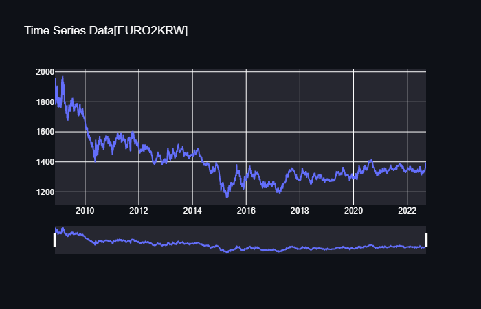
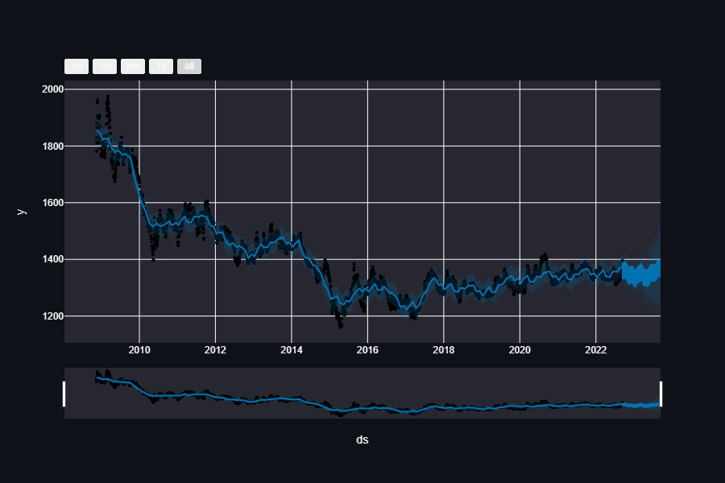
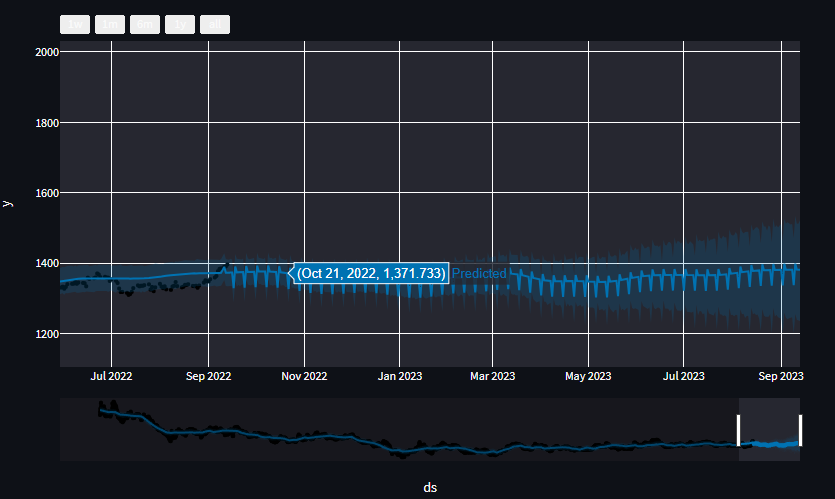

# KRW-Euro currency exchange rate forecasting with Prophet  

1. Download historical data from https://www.investing.com/currencies/eur-krw-historical-data  
you can set time interval e.g. [17.11.2008~13.09.2022]
   
     

2. Get data into the right format for prophet then fit the model to data and predict
    bellow can be found all needed info 
   https://machinelearningmastery.com/time-series-forecasting-with-prophet-in-python/  
3. Display results
      
     

